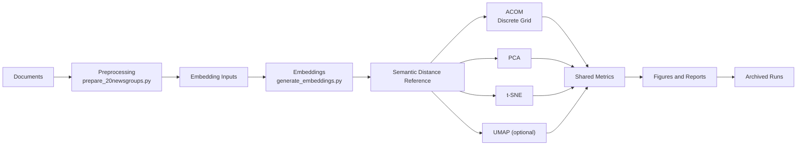

# LLM Document ACOM

Research pipeline for mapping document embeddings onto a discrete two-dimensional grid with ACOM and comparing that layout against PCA, t-SNE, and optional UMAP.

## Research Motivation

Most embedding visualization methods produce continuous 2D coordinates. Those methods are useful for inspection, but they do not solve a discrete placement problem. This project studies whether a discrete semantic map can preserve meaningful neighborhood structure while remaining interpretable as an explicit grid layout.

## Problem Statement

Given a set of document embeddings, construct a two-dimensional semantic map and evaluate how well that map preserves structure from the original embedding space. The repository focuses on two questions:

- How well can a discrete grid preserve semantic neighborhoods?
- How does that discrete layout compare with standard continuous baselines under shared metrics?

## Key Idea

The repository implements a Version 1 ACOM-style optimizer that places documents on a finite grid by repeated swap-based search. Documents begin in a reproducible random layout, then the algorithm improves that layout using a semantic-neighborhood cost. The same embeddings are also projected with PCA, t-SNE, and optional UMAP so that all methods can be evaluated consistently.

## Pipeline Overview



## Algorithms Compared

- `ACOM`: discrete grid-based mapping with swap optimization
- `PCA`: linear continuous baseline
- `t-SNE`: nonlinear local-neighborhood baseline
- `UMAP`: optional nonlinear baseline

## Repository Structure

```text
llm_document_acom/
├── src/              pipeline modules and experiment runners
├── data/             prepared data, splits, and embeddings
├── archive/          archived experiment runs and study snapshots
├── outputs/
│   ├── figures/
│   │   ├── grids/        ACOM grid layouts
│   │   ├── scatters/     PCA / t-SNE / UMAP scatter plots
│   │   ├── scaling/      scaling study line plots
│   │   ├── variants/     ACOM variant comparison bars
│   │   ├── discretized/  discretized baseline grids
│   │   ├── diagnostics/  cost histories, distance correlations, metric bars
│   │   └── panels/       multi-panel composite figures
│   ├── maps/         position CSVs for each method
│   └── reports/      metric CSVs, JSON summaries, collision reports
├── paper/            ACM sigconf LaTeX paper and figures
├── docs/             documentation and tracked review assets
├── requirements.txt
└── README.md
```

See [docs/REPOSITORY_STRUCTURE.md](docs/REPOSITORY_STRUCTURE.md) for a fuller layout description.

## Installation

```bash
python3 -m venv .venv
source .venv/bin/activate
pip install -r requirements.txt
```

The preferred embedding backend is `sentence-transformers` with `all-MiniLM-L6-v2`. If that backend is unavailable, the embedding pipeline falls back to TF-IDF.

## Quick Start

Prepare the benchmark subset:

```bash
python3 src/prepare_20newsgroups.py
```

Generate embeddings:

```bash
python3 src/generate_embeddings.py
```

Run the main experiment:

```bash
python3 src/run_experiment.py
```

Run with UMAP enabled:

```bash
python3 src/run_experiment.py --enable-umap
```

## Running Experiments

Single run on the prepared embedding set:

```bash
python3 src/run_experiment.py
```

Controlled ACOM variant sweep:

```bash
python3 src/run_acom_sweep.py
```

Scaling study for the tuned ACOM variant:

```bash
python3 src/run_acom_scaling.py
```

Discretize continuous baselines onto the same 10x10 grid for like-for-like comparison:

```bash
python3 src/discretize_baselines.py
python3 src/visualize_discretized_baselines.py
```

Thesis-oriented result summaries:

```bash
python3 src/generate_thesis_results.py
```

## Output Files

The project keeps two output layers:

- `outputs/`: latest run artifacts for quick inspection
- `archive/`: timestamped experiment records for comparison and reproducibility

Important report files include:

- `outputs/reports/metrics_summary.csv`
- `outputs/reports/acom_variant_comparison.csv`
- `outputs/reports/acom_scaling_results.csv`
- `outputs/reports/acom_results_table_pretty.csv`
- `outputs/reports/discretized_baselines_metrics.csv`
- `outputs/reports/full_comparison_with_discretized.csv`

The historical run index is stored at:

- `archive/runs/run_index.csv`

## Example Results

The strongest ACOM variant currently archived is `acom_v1_wider_swap_annealed`. On the 100-document benchmark, it improved over the baseline ACOM configuration from:

- neighborhood preservation: `0.134` to `0.367`
- trustworthiness: `0.567` to `0.787`
- final cost: `275.767` to `213.015`

In the tuned comparison, ACOM outperformed PCA on neighborhood preservation and trustworthiness, but remained below t-SNE and UMAP on those local-structure metrics.

### Discretized baseline comparison

When PCA, t-SNE, and UMAP are discretized onto the same 10x10 grid, ACOM is the only method that guarantees zero collisions (one document per cell). Collision counts for discretized baselines: PCA 27 collision cells (max 8 docs/cell), t-SNE 32 (max 4), UMAP 28 (max 7).

## Paper

An ACM sigconf paper is included in `paper/`. Build with:

```bash
cd paper && bash build.sh
```

The paper uses `tectonic` as its TeX engine and references figures from `paper/figures/`.

## Reproducibility

The repository is designed for reproducibility through:

- fixed random seeds in data preparation and experiment configuration
- explicit metadata and embedding alignment checks
- saved config snapshots for archived runs
- run manifests and cost histories
- shared metric implementations across all methods

Each archived run stores the exact configuration used to produce that result.

## Citation

No formal citation file is included yet. For academic use, cite the repository URL, access date, and the specific commit or archived run ID used in the analysis.

## Documentation

- [Architecture](docs/ARCHITECTURE.md)
- [ACOM Algorithm](docs/ALGORITHM_ACOM.md)
- [Experiments](docs/EXPERIMENTS.md)
- [Repository Structure](docs/REPOSITORY_STRUCTURE.md)
