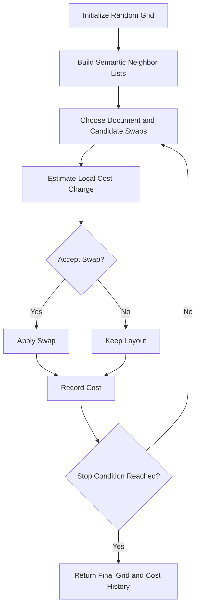

# ACOM Algorithm

## Introduction

This repository implements a Version 1 ACOM-style mapping algorithm for placing document embeddings onto a discrete two-dimensional grid. The current implementation is a swap-based stochastic optimizer inspired by swarm-style search, not a full pheromone-based ant colony system. That distinction matters: the method is intended as a clear, reproducible research baseline for discrete semantic mapping.

## Discrete Document Mapping Problem

The input is a set of document embeddings and a grid with enough capacity to hold them. Each document must occupy one grid cell. The optimization goal is to arrange the documents so that semantically related items are nearby on the grid while semantically poor local neighborhoods are discouraged.

## Why Continuous Methods Are Not Enough

Continuous methods such as PCA, t-SNE, and UMAP produce 2D coordinates but not discrete placements. If the final representation must be a grid, shelf, matrix, or map with explicit cell assignments, the projection problem changes. ACOM is designed for that discrete setting rather than for unconstrained continuous layout.

## ACOM Overview

The implementation in [`src/acom.py`](../src/acom.py) follows this structure:

1. initialize a random grid layout
2. compute semantic-neighbor lists from the embedding distance matrix
3. select candidate swaps
4. estimate local cost change over affected documents
5. accept or reject the swap
6. repeat until the iteration budget or early stopping condition is reached

The parameter `num_ants` controls how many swap proposals are evaluated per iteration. In the current implementation, these are proposal attempts rather than explicit agent trajectories moving across the grid.

## Grid Representation

The discrete grid is implemented in [`src/grid.py`](../src/grid.py).

- each document has exactly one position
- the grid may include empty cells if capacity exceeds document count
- the current implementation uses Euclidean grid distance by default
- local neighborhoods are defined by a configurable radius

This representation makes the output directly usable as a discrete semantic map.

## Optimization Objective

The current cost function has two components:

### Attraction term

Each document should stay close to its top semantic neighbors. These neighbors are derived from the normalized semantic distance matrix, and each neighbor is weighted by inverse rank.

### Repulsion term

Each document is penalized when its local grid neighborhood contains documents that are semantically distant in the original embedding space.

Conceptually:

```text
local_cost(i) =
  attraction_weight * sum_j(rank_weight(i, j) * normalized_grid_distance(i, j))
  + repulsion_weight * sum_k(normalized_semantic_distance(i, k))
```

where:

- `j` ranges over the top semantic neighbors of document `i`
- `k` ranges over documents currently near `i` on the grid

The total objective is the sum of local costs across all documents.

## Swap Candidate Search

The current algorithm does not evaluate all possible swaps. For a selected document, it builds a candidate set from:

- its closest semantic neighbors
- a small set of semantically distant documents
- its current grid neighbors
- a small random sample

This balances local improvement, escape from poor placements, and computational cost.

## Annealed Acceptance Strategy

The baseline ACOM configuration used greedy acceptance: only improving swaps were accepted. The tuned configuration adds annealed acceptance.

Under annealed acceptance:

- improving swaps are always accepted
- worsening swaps may be accepted with probability `exp(improvement / temperature)`
- temperature decreases over iterations

This improves search by allowing occasional uphill moves early in the run, which helps the optimizer escape local minima that greedy search cannot leave.

## Parameters and Configuration

The main ACOM parameters are defined in [`src/config.py`](../src/config.py) and exposed through [`src/run_experiment.py`](../src/run_experiment.py):

- `grid_rows`, `grid_cols`
- `num_ants`
- `max_iter`
- `neighbor_radius`
- `acom_semantic_k`
- `acom_attraction_weight`
- `acom_repulsion_weight`
- `acom_swap_candidates`
- `acom_acceptance_rule`
- `acom_temperature_start`
- `acom_temperature_decay`
- `acom_early_stopping_rounds`
- `random_seed`

The best-performing configuration (`acom_v1_wider_swap_annealed`) used: `grid_rows=10`, `grid_cols=10`, `num_ants=30`, `max_iter=120`, `neighbor_radius=1`, `acom_semantic_k=8`, `acom_attraction_weight=1.0`, `acom_repulsion_weight=0.35`, `acom_swap_candidates=20`, `acom_acceptance_rule=annealed`, `acom_temperature_start=0.03`, `acom_temperature_decay=0.985`, `acom_early_stopping_rounds=3`, and `random_seed=42`.

## Algorithm Workflow



## Pseudocode

```text
input: grid, semantic_distances, optimization parameters

initialize grid randomly
build top-k semantic neighbor lists
build reverse-neighbor links
compute initial total cost

for iteration in 1..max_iter:
    improved_this_round = false

    for proposal in 1..num_ants:
        choose document a
        build candidate set for a
        select candidate b with best local improvement estimate

        if accept(a, b, iteration):
            swap a and b
            if improvement > 0:
                improved_this_round = true

    record total cost

    if no improvement for early_stopping_rounds:
        break

return final positions, cost history, accepted swap count
```

## Computational Complexity

The implementation avoids exhaustive search. Practical runtime depends mainly on:

- number of documents `n`
- iterations
- proposals per iteration
- candidate-set size
- size of the affected document set used in local cost recomputation

This is substantially cheaper than recomputing full global cost for every candidate swap, but runtime still increases with dataset size, as shown in the scaling study.

## Limitations

- The method is heuristic rather than globally optimal.
- The current Version 1 implementation does not use pheromone memory.
- Discrete grid constraints make local-structure preservation harder than in continuous layouts.
- Larger document sets create a harder combinatorial search problem.
- Stress remains weaker than strong continuous baselines such as PCA.
- The proposal strategy is broader than the original baseline, but still not highly targeted toward the worst local mismatches.
- Quality degrades beyond approximately 100 documents. In the scaling study, neighborhood preservation dropped from `0.351` at 100 documents to `0.240` at 150 and `0.193` at 200, while stress rose from `5.146` to `6.931` and `8.180` respectively.
