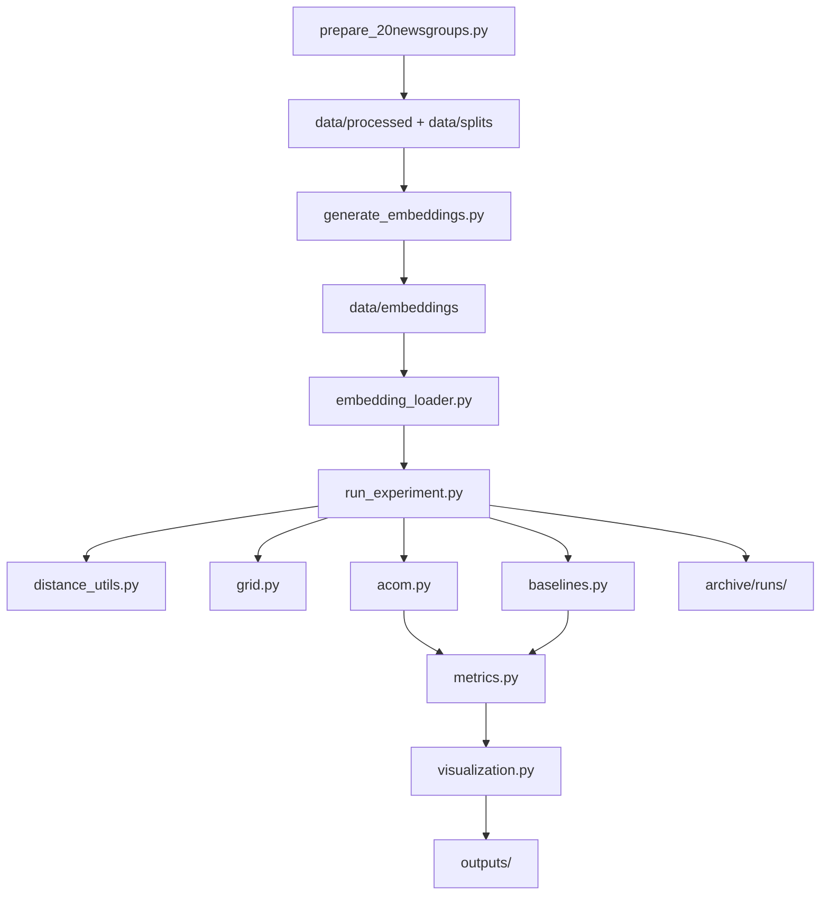
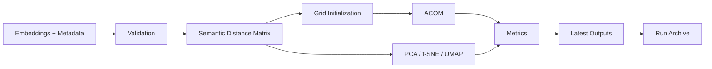

# Architecture

## System Overview

The repository is organized as a reproducible research pipeline with four connected stages:

1. dataset preparation
2. embedding generation
3. mapping and evaluation
4. archiving and report generation

The central execution path is implemented in [`src/run_experiment.py`](../src/run_experiment.py). Additional runners reuse the same core logic for controlled variant sweeps, scaling studies, and thesis-oriented result generation.

## Data Flow

- [`src/prepare_20newsgroups.py`](../src/prepare_20newsgroups.py) downloads the selected 20 Newsgroups categories, cleans text, and writes balanced splits plus embedding-input files.
- [`src/generate_embeddings.py`](../src/generate_embeddings.py) converts those inputs into aligned embedding arrays and metadata tables.
- [`src/run_experiment.py`](../src/run_experiment.py) validates inputs, runs ACOM and the continuous baselines, computes shared metrics, writes outputs, and archives the run.
- [`src/run_acom_sweep.py`](../src/run_acom_sweep.py), [`src/run_acom_scaling.py`](../src/run_acom_scaling.py), and [`src/generate_thesis_results.py`](../src/generate_thesis_results.py) extend that same pipeline for structured research studies.

## Module Responsibilities

- [`src/config.py`](../src/config.py)
  Defines `ExperimentConfig`, including data paths, grid size, optimization settings, and archive directories.

- [`src/prepare_20newsgroups.py`](../src/prepare_20newsgroups.py)
  Fetches the selected categories, applies light text cleaning, constructs balanced subsets, and writes raw, cleaned, split, and embedding-input files.

- [`src/text_cleaning.py`](../src/text_cleaning.py)
  Applies conservative normalization and document-validity checks.

- [`src/generate_embeddings.py`](../src/generate_embeddings.py)
  Generates embeddings with `sentence-transformers` or TF-IDF fallback and writes aligned metadata.

- [`src/embedding_loader.py`](../src/embedding_loader.py)
  Loads embeddings and metadata and validates row alignment and split consistency.

- [`src/distance_utils.py`](../src/distance_utils.py)
  Computes the semantic distance matrix used as the reference structure for evaluation.

- [`src/grid.py`](../src/grid.py)
  Manages the discrete grid, placement, neighbor lookup, and swap operations.

- [`src/acom.py`](../src/acom.py)
  Implements the swap-based ACOM optimizer and returns positions, cost history, and run statistics.

- [`src/baselines.py`](../src/baselines.py)
  Runs PCA, t-SNE, and optional UMAP on the same embedding matrix.

- [`src/metrics.py`](../src/metrics.py)
  Computes neighborhood preservation, trustworthiness, stress, silhouette, and distance correlation.

- [`src/visualization.py`](../src/visualization.py)
  Generates grid plots, scatter plots, metric comparison charts, distance-correlation plots, variant comparison plots, and scaling plots.

## Module Interaction

## Experiment Execution Pipeline

The main experiment runner executes the following steps:

1. parse configuration and CLI arguments
2. validate experiment settings
3. load embeddings and metadata
4. validate alignment and grid capacity
5. compute semantic distances
6. initialize the grid
7. run ACOM
8. run baseline methods
9. compute shared metrics
10. write latest outputs
11. archive the run and update the run index

## Run Archiving System

Each experiment receives a timestamped run ID such as:

- `run_2026-03-11_02-59-54_acom_v1_wider_swap_annealed`

Each archived run contains:

- `maps/`
- `figures/`
- `reports/`
- `config/config_snapshot.json`
- `run_manifest.json`

The run index is maintained at [`archive/runs/run_index.csv`](../archive/runs/run_index.csv). The scaling study additionally writes a study-level snapshot under [`archive/scaling_studies`](../archive/scaling_studies).

## Output Generation

The project separates working outputs from archival outputs:

- `outputs/`: latest generated artifacts
- `archive/`: durable experiment records

There is no standalone top-level `reports/` directory. Reports are written to:

- `outputs/reports/`
- `archive/runs/<run_id>/reports/`
- `archive/scaling_studies/<study_id>/reports/`

## Directory Roles

- `src/`
  Source code for preparation, embedding generation, mapping, evaluation, and reporting.

- `data/`
  Working data area for raw downloads, processed text, splits, and embeddings.

- `archive/`
  Long-term experiment history, archived runs, and study snapshots.

- `outputs/`
  Latest maps, figures, and reports from the most recent execution.

- `docs/`
  Repository-facing documentation plus selected tracked figures and result tables.
