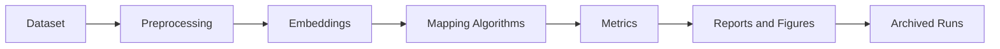

# Experiments

## Dataset Description

The benchmark dataset is a controlled five-category subset of 20 Newsgroups prepared by [`src/prepare_20newsgroups.py`](../src/prepare_20newsgroups.py).

Categories:

- `comp.graphics`
- `rec.sport.baseball`
- `sci.med`
- `sci.space`
- `talk.politics.misc`

The preparation step uses:

- `subset="train"` and `subset="test"`
- `remove=("headers", "footers", "quotes")`
- balanced sampling with fixed random seed

The default benchmark contains 100 documents in total: 50 train and 50 test.

## Data Preprocessing

Preprocessing is intentionally light so that semantic content remains intact. The cleaning stage applies:

- whitespace trimming
- line-break normalization
- blank-line reduction
- URL removal
- repeated-punctuation reduction
- removal of obvious leftover email artifacts
- rejection of empty or too-short documents

## Embedding Generation

Embeddings are generated by [`src/generate_embeddings.py`](../src/generate_embeddings.py).

Primary backend:

- `sentence-transformers`
- model: `all-MiniLM-L6-v2`

Fallback backend:

- TF-IDF via scikit-learn

Saved outputs include:

- `train_embeddings.npy`
- `test_embeddings.npy`
- `all_embeddings.npy`
- aligned metadata CSV files
- `archive/embeddings/embedding_report.json`

## Dimensionality Reduction Methods

The continuous comparison methods are implemented in [`src/baselines.py`](../src/baselines.py):

- `PCA`
- `t-SNE`
- `UMAP` when available in the local environment

All methods operate on the same prepared embedding matrix used by ACOM.

## Evaluation Metrics

Metrics are implemented in [`src/metrics.py`](../src/metrics.py).

### Neighborhood Preservation

For each document, compute the `k` nearest neighbors in the original embedding space and in the mapped space, then measure overlap. This captures how well local semantic neighborhoods survive projection.

### Trustworthiness

Trustworthiness measures whether neighbors introduced by the mapped space are genuinely close in the original embedding space. High trustworthiness means the projection introduces fewer false local neighbors.

### Stress

Stress measures disagreement between original pairwise distances and mapped distances. Lower stress indicates better preservation of global geometry.

### Additional Metrics

When labels are available, the pipeline also computes:

- silhouette score
- distance correlation

## ACOM Variant Experiments

Controlled ACOM tuning is executed by [`src/run_acom_sweep.py`](../src/run_acom_sweep.py).

Current named variants include:

- `acom_v1_baseline`
- `acom_v1_k10`
- `acom_v1_more_iters`
- `acom_v1_stronger_repulsion`
- `acom_v1_wider_swap_search`
- `acom_v1_radius2`
- `acom_v1_wider_swap_annealed`

These experiments are designed as controlled changes so that each variant isolates one main design decision.

## Scaling Experiments

Scalability experiments are executed by [`src/run_acom_scaling.py`](../src/run_acom_scaling.py).

The current scaling study evaluates the tuned ACOM variant on:

- 50 documents
- 100 documents
- 150 documents
- 200 documents

Balanced category allocation is preserved as closely as possible, and the study uses size-specific grids:

- `8x8`
- `10x10`
- `13x13`
- `15x15`

Unlike the main comparison run, the scaling study focuses on ACOM behavior across sizes rather than rerunning continuous baselines for every size.

## Research Workflow

## Run Archiving

Experiment outputs are split across:

- [`archive/runs`](../archive/runs)
- `outputs/maps/`
- `outputs/figures/`
- `outputs/reports/`

For each archived run, the pipeline stores:

- mapping outputs
- figure files
- metrics summaries
- ACOM cost history
- config snapshot
- run manifest

The historical run index is maintained in [`archive/runs/run_index.csv`](../archive/runs/run_index.csv).

## Result Tables

The repository currently includes several thesis-oriented summary outputs, including:

- `outputs/reports/acom_variant_comparison.csv`
- `outputs/reports/acom_results_table_pretty.csv`
- `outputs/reports/acom_scaling_results.csv`
- `outputs/reports/tuned_acom_metrics_summary.csv`

These files support later method comparison, reporting, and thesis tables.
