# Project Research Report

## Key Findings

- Annealed acceptance on top of wider swap search increased neighborhood preservation from `0.239` to `0.367`, a relative improvement of approximately `53.6%` over the best greedy wide-search variant.
- The tuned ACOM variant outperformed PCA on neighborhood preservation (`0.367` vs `0.329`) and trustworthiness (`0.787` vs `0.758`) on the 100-document benchmark.
- t-SNE still achieved the strongest local-structure preservation in the final comparison, with neighborhood preservation `0.523` and trustworthiness `0.893`.
- ACOM remained stable as dataset size increased from `50` to `200` documents, but neighborhood preservation and trustworthiness declined beyond `100` documents while stress increased.

## 1. Project Overview

This project investigates whether document embeddings can be mapped to a **discrete two-dimensional semantic grid** using a swarm-inspired optimization procedure. The repository implements ACOM as a grid-based optimizer and compares it against continuous projection methods that operate on the same embedding set.

The central engineering idea is straightforward: prepare a controlled document benchmark, generate embeddings, run multiple mapping methods, evaluate them with shared metrics, and archive every experiment so results remain reproducible.

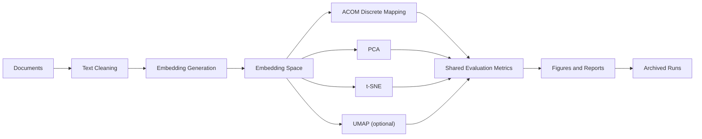

### Repository Context

The project is organized as a research pipeline rather than a single script. Source modules, working data, latest outputs, and archived experiments are separated so that multiple runs and tuned variants can be compared cleanly.

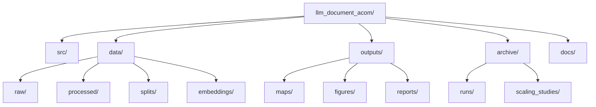

## 2. Research Problem

The main research question is:

> Can a swarm-inspired ACOM procedure place document embeddings onto a discrete grid while preserving semantic relationships well enough to support meaningful interpretation?

This problem differs from standard dimensionality reduction. PCA, t-SNE, and UMAP produce continuous scatter plots. Those plots are useful for visualization, but they do not solve a discrete placement problem. A discrete grid is interesting because it yields:

- explicit cell assignments
- structured semantic maps rather than free-floating points
- a representation closer to shelf, matrix, or dashboard layouts

The cost of that explicit structure is additional geometric constraint. The experiments in this repository therefore examine whether a discrete grid can preserve enough semantic structure to be competitive.

## 3. Dataset

The benchmark is a controlled five-category subset of **20 Newsgroups** prepared with [`src/prepare_20newsgroups.py`](../src/prepare_20newsgroups.py). The selected categories are:

- `comp.graphics`
- `rec.sport.baseball`
- `sci.med`
- `sci.space`
- `talk.politics.misc`

The repository uses:

- `subset="train"` and `subset="test"`
- `remove=("headers", "footers", "quotes")`
- fixed random seed `42`
- balanced sampling
- light semantic-preserving cleaning

### Dataset Composition

| Split | Raw downloaded | Selected | Docs per category | Avg chars | Avg words |
|---|---:|---:|---:|---:|---:|
| Train | 2833 | 50 | 10 | 1320.30 | 207.26 |
| Test | 1886 | 50 | 10 | 1149.92 | 191.74 |
| Combined | 4719 | 100 | 20 | - | - |

Table values are taken directly from `data/processed/dataset_report.json`.

### Balanced Category Allocation

| Category | Train | Test | Total |
|---|---:|---:|---:|
| comp.graphics | 10 | 10 | 20 |
| rec.sport.baseball | 10 | 10 | 20 |
| sci.med | 10 | 10 | 20 |
| sci.space | 10 | 10 | 20 |
| talk.politics.misc | 10 | 10 | 20 |

## 4. Embedding Generation

Embeddings are produced by [`src/generate_embeddings.py`](../src/generate_embeddings.py). The preferred backend is `sentence-transformers`, with TF-IDF available as a fallback if the transformer backend is unavailable.

### Embedding Configuration

| Item | Value |
|---|---|
| Backend used | `sentence-transformers` |
| Model | `all-MiniLM-L6-v2` |
| Embedding dimension | `384` |
| Documents embedded | `100` |
| Total runtime | `5.7658` seconds |

### Saved Embedding Shapes

| Split | Shape |
|---|---|
| Train | `(50, 384)` |
| Test | `(50, 384)` |
| All | `(100, 384)` |

This model was chosen because it provides a strong local sentence/document embedding baseline with a compact dimension, fast inference, and broad compatibility with downstream cosine-based semantic evaluation.

## 5. Algorithms Compared

The project compares one discrete mapping approach and three continuous baselines:

- **ACOM**
  Grid-based mapping optimized through swap proposals and a semantic-neighborhood objective.

- **PCA**
  Linear projection baseline that preserves global variance structure.

- **t-SNE**
  Nonlinear projection baseline focused on local-neighborhood preservation.

- **UMAP**
  Nonlinear manifold-learning baseline that often balances local structure and broader geometry.

The comparison is intentionally controlled: all methods operate on the same prepared embedding matrix, and all are evaluated with the same metric implementation.

## 6. First ACOM Implementation

The first ACOM implementation was a reproducible Version 1 baseline:

- `10x10` grid
- random initialization
- swap-based local search
- greedy acceptance only
- semantic top-k = `8`
- neighborhood radius = `1`
- swap candidate breadth = `12`

The algorithm treated `num_ants` as the number of proposal attempts per iteration rather than as explicit moving agents. This made the first version simple, readable, and suitable as a baseline research implementation.

### Baseline ACOM Metrics

| Variant | Final cost | Cost improvement | Neighborhood preservation | Trustworthiness | Stress |
|---|---:|---:|---:|---:|---:|
| `acom_v1_baseline` | 275.767 | 25.063 | 0.134 | 0.567 | 5.120 |

### Baseline ACOM Grid

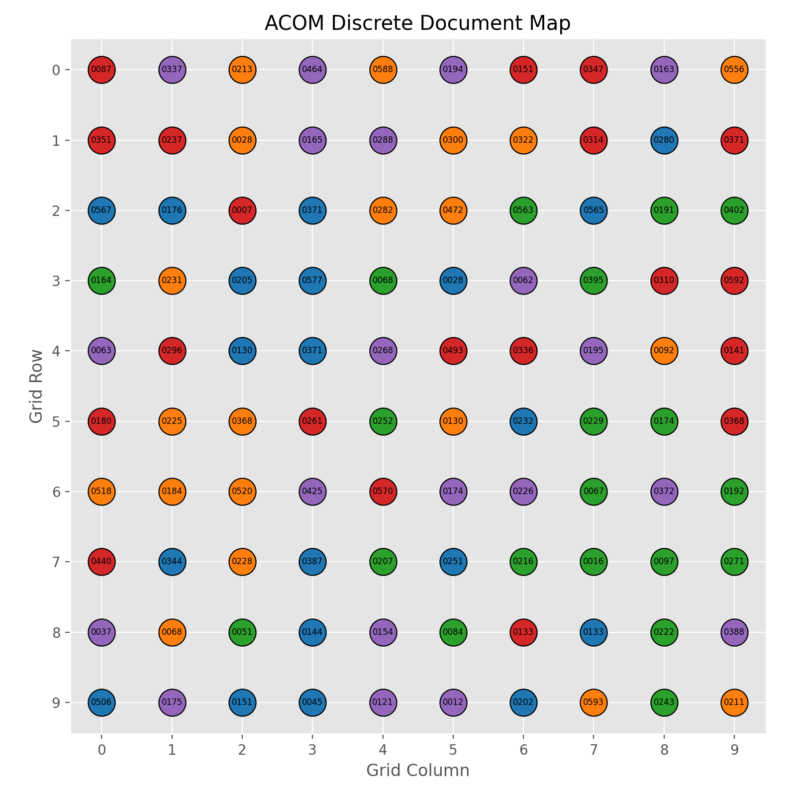

*Figure 1. Discrete grid produced by the first ACOM baseline run.*

### Baseline ACOM Cost History

*Figure 2. Cost curve for the first ACOM baseline run.*

### Initial Limitations

The first version improved its internal objective, but the external structure-preservation metrics were weak. Neighborhood preservation and trustworthiness were both low, and the cost curve suggests that greedy local search was not exploring the search space aggressively enough.

## 7. Observed Problems

The first ACOM version revealed three main problems:

1. **Greedy search trapped the optimizer early.**
   The cost curve in Figure 2 falls quickly and then plateaus, which is typical of local trapping.

2. **Neighborhood preservation was poor.**
   The baseline score of `0.134` was well below later tuned results.

3. **Trustworthiness was weak relative to the tuned variant and the continuous baselines.**
   The baseline trustworthiness of `0.567` indicates that many neighbors in the mapped grid were not reliable neighbors in embedding space.

### Baseline vs Tuned ACOM

| Variant | Neighborhood preservation | Trustworthiness | Final cost |
|---|---:|---:|---:|
| `acom_v1_baseline` | 0.134 | 0.567 | 275.767 |
| `acom_v1_wider_swap_annealed` | 0.367 | 0.787 | 213.015 |

This gap provided the main motivation for the controlled ACOM improvement phase.

## 8. Algorithm Improvements

The algorithm was improved incrementally rather than replaced wholesale. Each change was introduced as a named variant and evaluated under the same metrics.

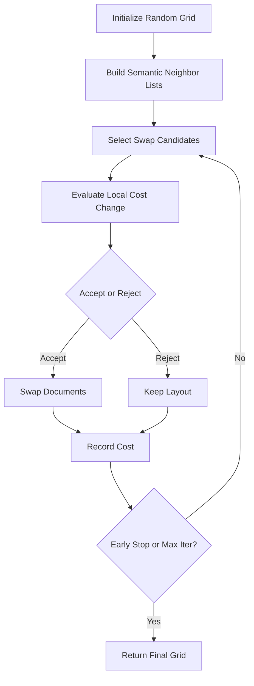

### Variant Comparison Table

| Variant | Main change | Final cost | Cost improvement | Neighborhood preservation | Trustworthiness | Stress |
|---|---|---:|---:|---:|---:|---:|
| `acom_v1_baseline` | Greedy baseline | 275.767 | 25.063 | 0.134 | 0.567 | 5.120 |
| `acom_v1_k10` | More semantic neighbors | 261.565 | 47.815 | 0.189 | 0.609 | 5.115 |
| `acom_v1_more_iters` | More iterations | 252.119 | 48.711 | 0.191 | 0.637 | 5.115 |
| `acom_v1_stronger_repulsion` | Higher repulsion | 354.963 | 27.676 | 0.137 | 0.574 | 5.120 |
| `acom_v1_radius2` | Larger local radius | 570.195 | 56.417 | 0.188 | 0.625 | 5.116 |
| `acom_v1_wider_swap_search` | Wider candidate search | 234.524 | 66.307 | 0.239 | 0.683 | 5.112 |
| `acom_v1_wider_swap_annealed` | Wider search + annealing | 213.015 | 87.815 | 0.367 | 0.787 | 5.107 |

### Variant Comparison Figure

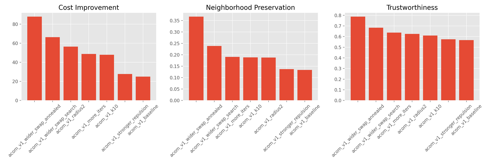

*Figure 3. Comparison of cost improvement, neighborhood preservation, and trustworthiness across named ACOM variants.*

### Improvement Step 1: Wider Swap Candidate Search

The first clearly successful change was **wider swap search**. Increasing the candidate breadth from `12` to `20` improved:

- neighborhood preservation from `0.134` to `0.239`
- trustworthiness from `0.567` to `0.683`
- final cost from `275.767` to `234.524`

**Evidence:** the wider-search row in the variant comparison table and the jump visible in Figure 3.

**Interpretation:** better candidate coverage helped the optimizer escape poor local swap choices without changing the cost function itself.

### Improvement Step 2: Annealed Acceptance

The strongest improvement came from adding **annealed acceptance** on top of wider search. Relative to `acom_v1_wider_swap_search`, the annealed variant improved:

- neighborhood preservation from `0.239` to `0.367`
- trustworthiness from `0.683` to `0.787`
- final cost from `234.524` to `213.015`

**Evidence:** the last two rows of the variant comparison table and the rightmost ranking in Figure 3.

**Interpretation:** occasional uphill moves reduced local trapping and produced more semantically coherent layouts than greedy acceptance alone.

## 9. Evaluation Metrics

All methods are evaluated against the original embedding space using the same metric implementation.

### Neighborhood Preservation

Measures how many nearest neighbors from the original embedding space remain neighbors after mapping. Higher is better.

### Trustworthiness

Measures whether neighbors introduced by the mapped space are genuinely close in the original embedding space. Higher is better.

### Stress

Measures the mismatch between original pairwise distances and mapped distances. Lower is better.

### Experiment Pipeline

## 10. Experimental Results

The strongest final method comparison uses the tuned ACOM variant against PCA, t-SNE, and UMAP on the same 100-document embedding set.

### Final Tuned Comparison

| Method | Neighborhood Preservation | Trustworthiness | Stress |
|---|---:|---:|---:|
| ACOM (Tuned) | 0.367 | 0.787 | 5.107 |
| PCA | 0.329 | 0.758 | 0.612 |
| t-SNE | 0.523 | 0.893 | 13.242 |
| UMAP | 0.505 | 0.897 | 2.850 |

### Metric Comparison Figure

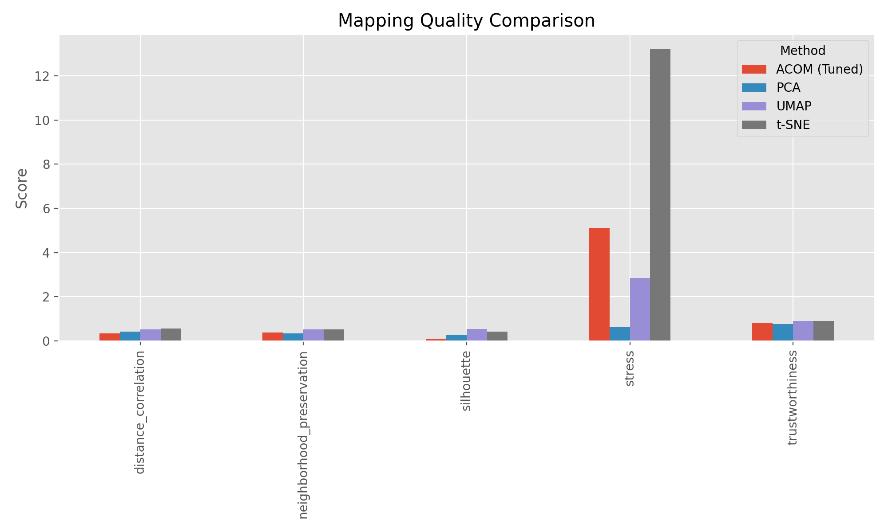

*Figure 4. Final metric comparison between the tuned ACOM variant and the continuous baselines.*

### Interpretation

- **ACOM vs PCA:** ACOM improved local-structure metrics over PCA, but PCA remained much stronger on stress.
- **ACOM vs t-SNE:** t-SNE preserved local neighborhoods better.
- **ACOM vs UMAP:** UMAP also preserved local neighborhoods better and achieved much lower stress.

This is an important research outcome: the tuned ACOM variant became competitive with PCA on local structure while still remaining a discrete method, but continuous nonlinear methods retained an advantage on local semantic preservation.

## 11. Visual Comparison of Methods

### Tuned ACOM Grid

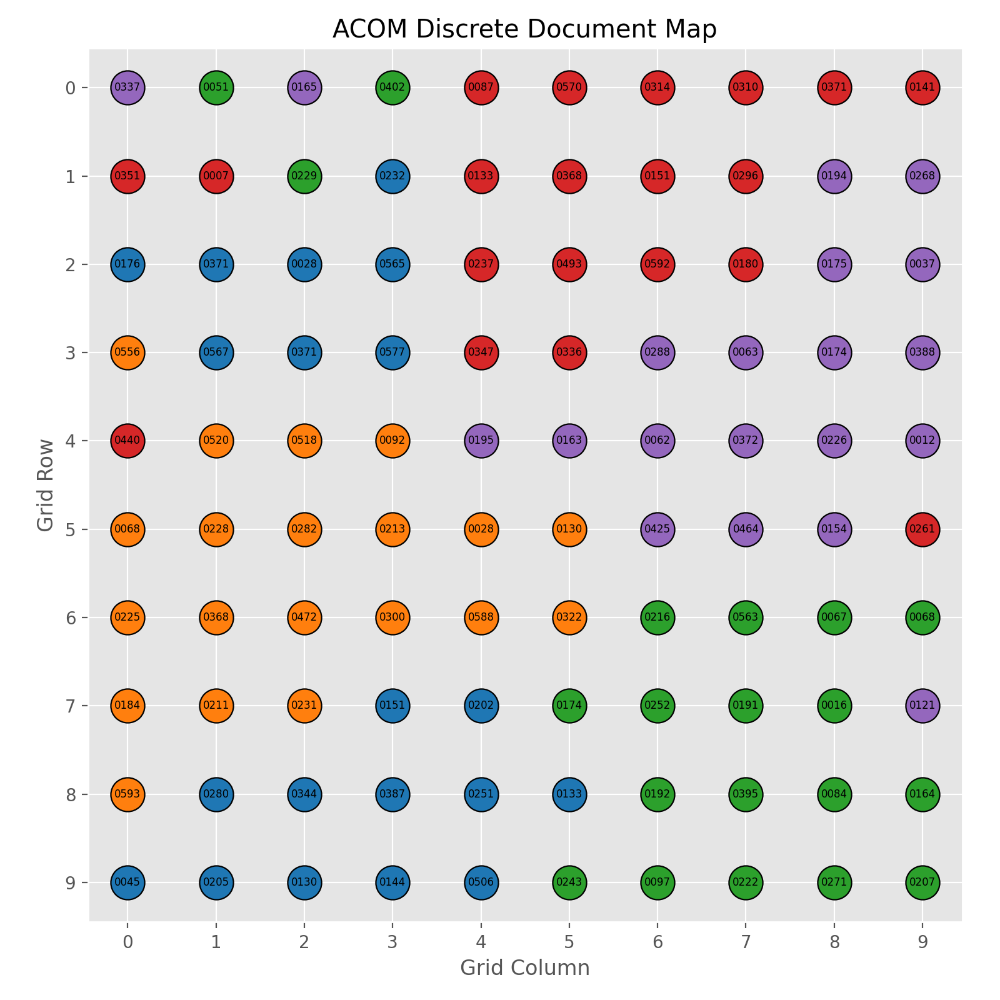

*Figure 5. Tuned ACOM discrete document map.*

### PCA

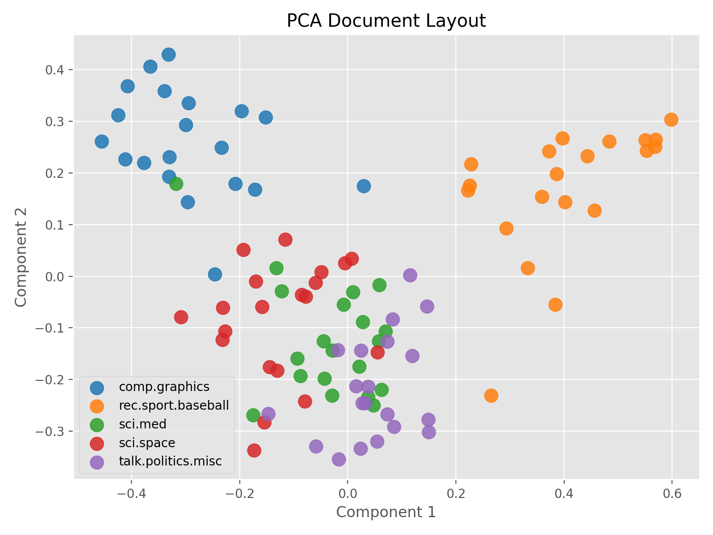

*Figure 6. PCA projection on the same embedding set.*

### t-SNE

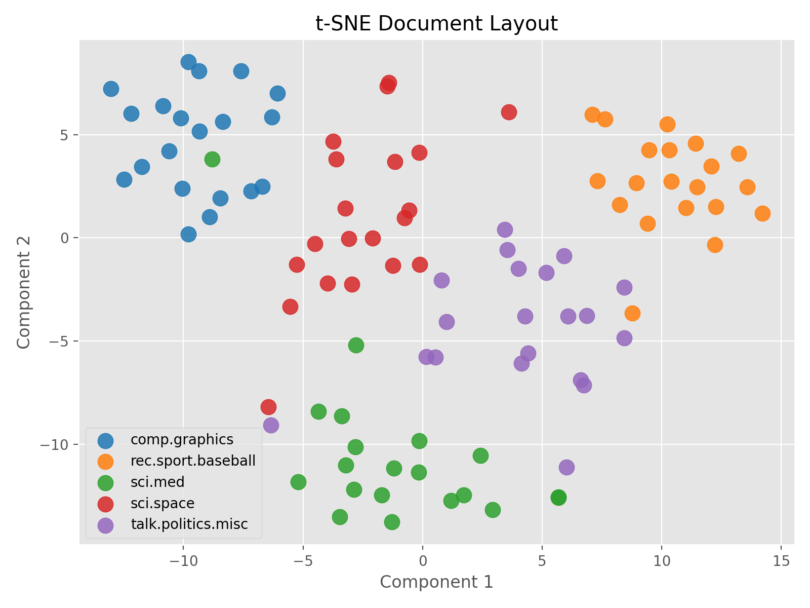

*Figure 7. t-SNE projection on the same embedding set.*

### UMAP

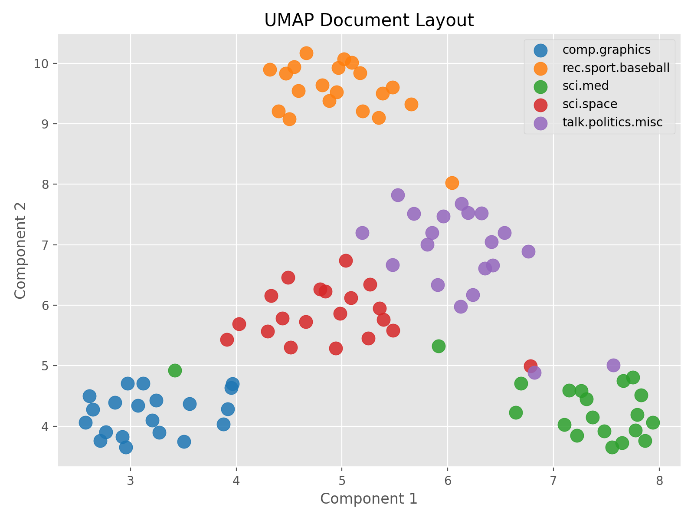

*Figure 8. UMAP projection on the same embedding set.*

### Visual Interpretation

- The tuned ACOM output is more structured and explicitly discrete, which makes it easier to interpret as a semantic grid.
- PCA is visually smooth but less effective at local separation.
- t-SNE creates the sharpest local cluster structure.
- UMAP preserves strong local structure while remaining more globally readable than t-SNE.

## 12. Best ACOM Variant

The best-performing ACOM configuration in the completed tuning study was:

- `acom_v1_wider_swap_annealed`

### Why It Performed Best

It combined two changes that addressed the main weaknesses of the baseline:

1. wider swap candidate search
2. annealed acceptance instead of purely greedy acceptance

Together, these improved both optimization quality and semantic neighborhood preservation.

### Cost History of the Best Variant

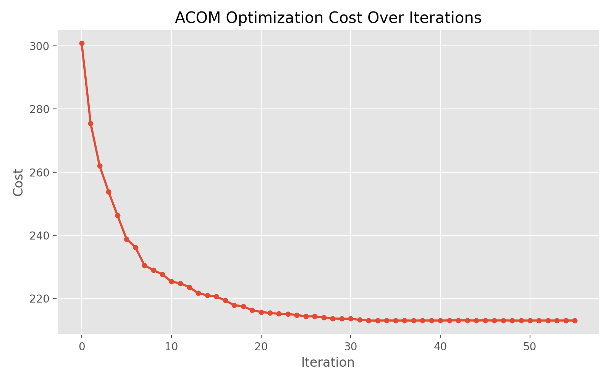

*Figure 9. Cost history for the tuned `acom_v1_wider_swap_annealed` run.*

### Best-Variant Summary

| Variant | Initial cost | Final cost | Cost improvement | Neighborhood preservation | Trustworthiness |
|---|---:|---:|---:|---:|---:|
| `acom_v1_wider_swap_annealed` | 300.831 | 213.015 | 87.815 | 0.367 | 0.787 |

Figure 9 shows a deeper and more sustained descent than the baseline greedy run in Figure 2, which supports the interpretation that annealed acceptance reduced premature convergence.

## 13. Scaling Experiments

The final phase tested whether the tuned ACOM variant remained stable as the number of documents increased. The scaling study used:

- the same five categories
- the same embedding model
- balanced sampling at each size
- size-specific grids: `8x8`, `10x10`, `13x13`, `15x15`

### Scaling Results Table

| Docs | Grid | Runtime (s) | Initial cost | Final cost | Improvement | Neighborhood preservation | Trustworthiness | Stress |
|---:|---|---:|---:|---:|---:|---:|---:|---:|
| 50 | 8x8 | 13.364 | 126.863 | 92.533 | 34.329 | 0.342 | 0.728 | 3.989 |
| 100 | 10x10 | 15.104 | 296.811 | 214.950 | 81.861 | 0.351 | 0.780 | 5.146 |
| 150 | 13x13 | 38.993 | 415.038 | 294.599 | 120.440 | 0.240 | 0.723 | 6.931 |
| 200 | 15x15 | 36.096 | 553.354 | 408.516 | 144.837 | 0.193 | 0.705 | 8.180 |

### Runtime Scaling

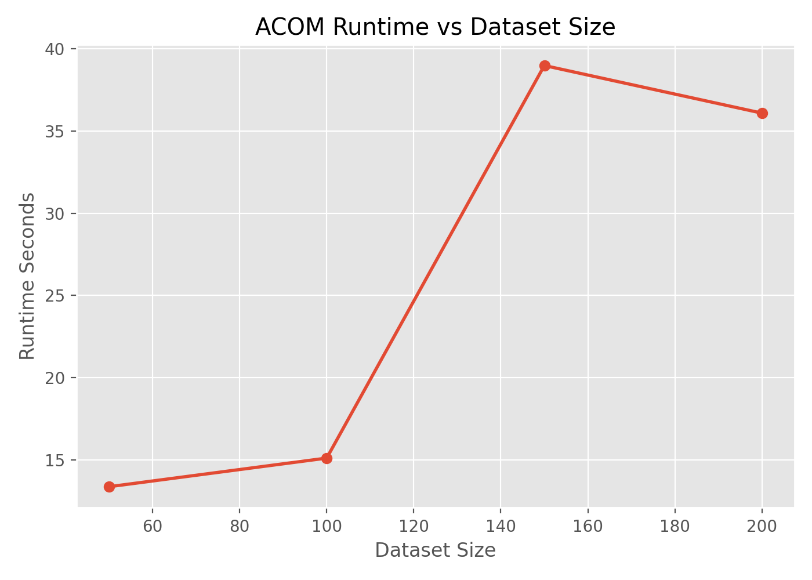

*Figure 10. Runtime trend across dataset sizes.*

### Neighborhood Preservation Scaling

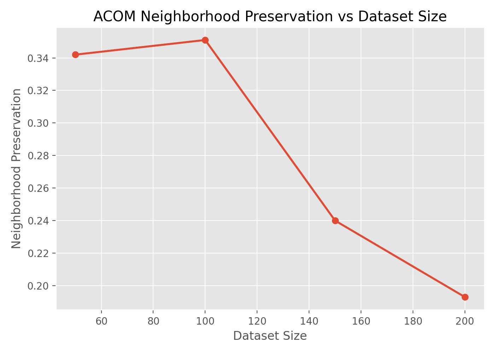

*Figure 11. Neighborhood preservation across dataset sizes.*

### Trustworthiness Scaling

*Figure 12. Trustworthiness across dataset sizes.*

### Stress Scaling

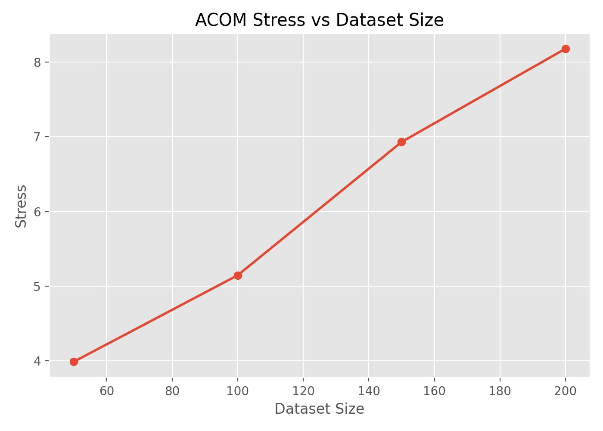

*Figure 13. Stress across dataset sizes.*

### Interpretation

- ACOM remained operational and improved cost at all sizes.
- Local structure was strongest at `100` documents.
- Quality deteriorated after `100` documents as neighborhood preservation and trustworthiness fell.
- Stress increased steadily with scale, showing that discrete distortion becomes harder to control on larger maps.

## 14. Limitations

The experiments reveal several clear limitations:

- ACOM still underperforms t-SNE and UMAP on neighborhood preservation and trustworthiness.
- Stress remains much worse than PCA, which indicates weaker preservation of global pairwise geometry.
- The discrete grid constraint introduces distortion that continuous methods do not face.
- Performance degrades beyond `100` documents in the current scaling study.
- The current optimizer is still heuristic and local, not globally optimal.

### Evidence of Remaining Gap

The final tuned comparison in Table 8 and Figure 4 shows that ACOM improved enough to exceed PCA on local-structure metrics, but it did not match t-SNE or UMAP on the same embedding set.

## 15. Future Work

The completed experiments suggest several promising next steps:

- **Targeted swap proposals**
  Prioritize documents with the highest local cost and move them toward stronger semantic neighborhoods.

- **Alternative cost functions**
  Weight local and global structure more explicitly rather than relying only on the current attraction/repulsion balance.

- **Multi-scale mapping**
  Build coarse-to-fine layouts so larger document sets are not optimized from a single flat initialization.

- **Hierarchical grid layouts**
  Use nested regions or topic-aware subgrids to reduce congestion in large maps.

Among these, the most immediately promising improvement is a **more targeted swap proposal mechanism**, because the tuning and scaling experiments both suggest that search efficiency is the main bottleneck once the grid becomes larger.
