# Project Research Report

## Key Findings

- Annealed acceptance on top of wider swap search increased neighborhood preservation from `0.239` to `0.367`, a relative improvement of approximately `53.6%` over the best greedy wide-search variant.
- The tuned ACOM variant outperformed PCA on neighborhood preservation (`0.367` vs `0.329`) and trustworthiness (`0.787` vs `0.758`) on the 100-document benchmark.
- t-SNE still achieved the strongest local-structure preservation in the final comparison, with neighborhood preservation `0.523` and trustworthiness `0.893`.
- ACOM remained stable as dataset size increased from `50` to `200` documents, but neighborhood preservation and trustworthiness declined beyond `100` documents while stress increased.
- Discretizing the continuous baselines onto the same 10×10 grid barely changes their metrics (PCA neighborhood preservation drops from `0.329` to `0.324`, t-SNE from `0.523` to `0.490`, UMAP from `0.505` to `0.471`) while producing significant collisions (PCA: 27 collision cells with max 8 docs/cell, t-SNE: 32 with max 4, UMAP: 28 with max 7). ACOM produces zero collisions by design, confirming that the quality gap is structural and not a measurement artifact.

## Executive Summary

### What the project is

This project builds and evaluates a research pipeline for mapping document embeddings onto a **discrete two-dimensional grid** using ACOM, then comparing that discrete map against standard continuous dimensionality-reduction methods.

### Dataset used

The experiments use a balanced five-category subset of **20 Newsgroups**:

- `comp.graphics`
- `rec.sport.baseball`
- `sci.med`
- `sci.space`
- `talk.politics.misc`

The main benchmark contains `100` documents in total, sampled with fixed random seed and light semantic-preserving cleaning.

### Embedding model used

The main embedding backend is `sentence-transformers` with:

- model: `all-MiniLM-L6-v2`
- dimension: `384`

### Algorithms compared

The project compares:

- `ACOM` for discrete grid mapping
- `PCA`
- `t-SNE`
- `UMAP`

### Best ACOM version

The strongest ACOM variant in the completed experiments is:

- `acom_v1_wider_swap_annealed`

This version combined wider swap candidate search with annealed acceptance and produced the best ACOM results on cost improvement, neighborhood preservation, and trustworthiness.

### Main experimental finding

The main result is that tuned ACOM became meaningfully stronger than the original baseline and exceeded PCA on two key local-structure metrics:

- neighborhood preservation: `0.367` for tuned ACOM vs `0.329` for PCA
- trustworthiness: `0.787` for tuned ACOM vs `0.758` for PCA

However, continuous nonlinear methods remained stronger on local semantic structure:

- `t-SNE`: neighborhood preservation `0.523`, trustworthiness `0.893`
- `UMAP`: neighborhood preservation `0.505`, trustworthiness `0.897`

### Current limitation

The current ACOM implementation remains limited by the discrete grid constraint and by search efficiency at larger scales. It still underperforms t-SNE and UMAP on local-structure preservation, and its quality degrades as the number of documents increases beyond the 100-document benchmark.

## 1. Project Overview

This project investigates whether document embeddings can be mapped to a **discrete two-dimensional semantic grid** using a swarm-inspired optimization procedure. The repository implements ACOM as a grid-based optimizer and compares it against continuous projection methods on the same embedding set.

The overall workflow is straightforward: prepare a controlled benchmark, generate embeddings, run multiple mapping methods, evaluate them with shared metrics, and archive each experiment so the results remain reproducible.

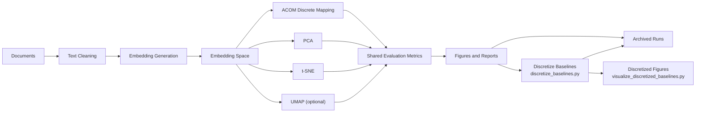

### Method Comparison: Continuous vs Discrete Outputs

The most important conceptual distinction in the project is that PCA, t-SNE, and UMAP solve a **continuous projection** problem, while ACOM solves a **discrete placement** problem.

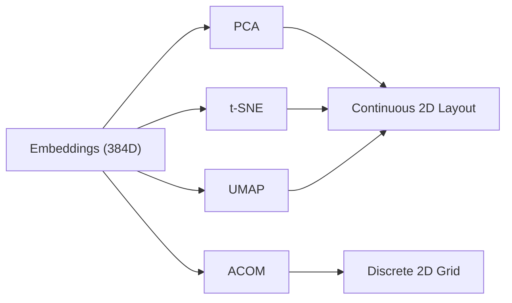

### Representative Final ACOM Output

The tuned ACOM system produces an explicit semantic grid rather than a scatter plot. Figure 1 shows the final discrete output that the rest of the report explains and justifies.

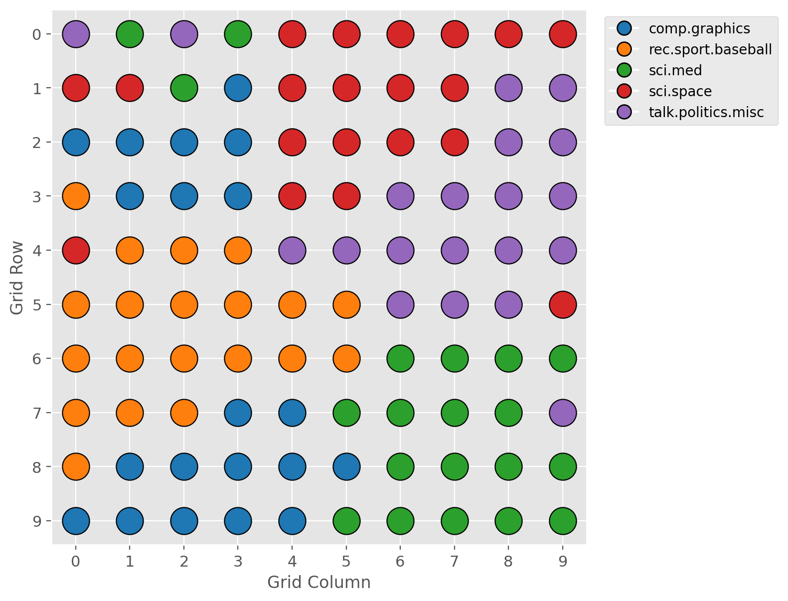

*Figure 1. Tuned `acom_v1_wider_swap_annealed` grid layout on the 100-document benchmark.*

## Key Decisions

| Decision | Selected option | Reason |
|---|---|---|
| Dataset | 20 Newsgroups subset | Controlled, labeled benchmark with diverse topics |
| Categories | `comp.graphics`, `rec.sport.baseball`, `sci.med`, `sci.space`, `talk.politics.misc` | Balanced topical diversity with manageable scope |
| Embedding model | `all-MiniLM-L6-v2` | Compact 384D embeddings with strong practical quality |
| Core metrics | Neighborhood preservation, trustworthiness, stress | Shared comparison across discrete and continuous mappings |
| Final ACOM reference | `acom_v1_wider_swap_annealed` | Best internal optimization and best local-structure scores among ACOM variants |

### Repository Context

The project is organized as a research pipeline rather than a single script. Source modules, working data, latest outputs, and archived experiments are separated so that multiple runs and ACOM variants can be compared cleanly.

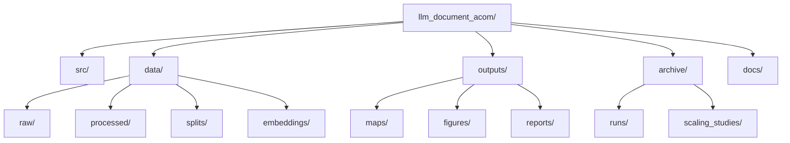

## 2. Research Problem

The main research question is:

> Can a swarm-inspired ACOM procedure place document embeddings onto a discrete grid while preserving semantic relationships well enough to support meaningful interpretation?

This problem differs from standard dimensionality reduction. PCA, t-SNE, and UMAP produce continuous scatter plots. Those plots are useful for visualization, but they do not solve a discrete placement problem. A discrete grid is interesting because it yields:

- explicit cell assignments
- structured semantic maps rather than free-floating points
- a representation closer to shelf, matrix, or dashboard layouts

The cost of that explicit structure is additional geometric constraint. The core empirical question is therefore whether a discrete grid can preserve enough semantic structure to remain useful.

## 3. Dataset

The benchmark is a controlled five-category subset of **20 Newsgroups** prepared with [`src/prepare_20newsgroups.py`](../src/prepare_20newsgroups.py). The selected categories are:

- `comp.graphics`
- `rec.sport.baseball`
- `sci.med`
- `sci.space`
- `talk.politics.misc`

The repository uses:

- `subset="train"` and `subset="test"`
- `remove=("headers", "footers", "quotes")`
- fixed random seed `42`
- balanced sampling
- light semantic-preserving cleaning

The benchmark was intentionally kept small and balanced so that changes in ACOM behavior would be easier to interpret.

### Dataset Composition

| Split | Raw downloaded | Selected | Docs per category | Avg chars | Avg words |
|---|---:|---:|---:|---:|---:|
| Train | 2833 | 50 | 10 | 1320.30 | 207.26 |
| Test | 1886 | 50 | 10 | 1149.92 | 191.74 |
| Combined | 4719 | 100 | 20 | - | - |

Table values are taken directly from `data/processed/dataset_report.json`.

### Balanced Category Allocation

| Category | Train | Test | Total |
|---|---:|---:|---:|
| comp.graphics | 10 | 10 | 20 |
| rec.sport.baseball | 10 | 10 | 20 |
| sci.med | 10 | 10 | 20 |
| sci.space | 10 | 10 | 20 |
| talk.politics.misc | 10 | 10 | 20 |

## 4. Embedding Generation

Embeddings are produced by [`src/generate_embeddings.py`](../src/generate_embeddings.py). The preferred backend is `sentence-transformers`, with TF-IDF available as a fallback if the transformer backend is unavailable.

### Embedding Configuration

| Item | Value |
|---|---|
| Backend used | `sentence-transformers` |
| Model | `all-MiniLM-L6-v2` |
| Embedding dimension | `384` |
| Documents embedded | `100` |
| Total runtime | `5.7658` seconds |

### Saved Embedding Shapes

| Split | Shape |
|---|---|
| Train | `(50, 384)` |
| Test | `(50, 384)` |
| All | `(100, 384)` |

This model was chosen because it provides a strong local sentence/document embedding baseline with a compact dimension, fast inference, and broad compatibility with downstream cosine-based semantic evaluation.

## 5. Algorithms Compared

The project compares one discrete mapping approach and three continuous baselines:

- **ACOM**
  Grid-based mapping optimized through swap proposals and a semantic-neighborhood objective.

- **PCA**
  Linear projection baseline that preserves global variance structure.

- **t-SNE**
  Nonlinear projection baseline focused on local-neighborhood preservation.

- **UMAP**
  Nonlinear manifold-learning baseline that often balances local structure and broader geometry.

The comparison is intentionally controlled: all methods operate on the same prepared embedding matrix and are evaluated with the same metric implementation.

## 6. First ACOM Implementation

The first ACOM implementation was designed as a clean baseline rather than a highly tuned final algorithm. Its role was to establish whether a discrete grid mapping could work at all before more targeted refinements were introduced.

The baseline configuration used:

- `10x10` grid
- random initialization
- swap-based local search
- greedy acceptance only
- semantic top-k = `8`
- neighborhood radius = `1`
- swap candidate breadth = `12`

The algorithm treated `num_ants` as the number of proposal attempts per iteration rather than as explicit moving agents. This kept the first version simple, readable, and easy to evaluate as a research baseline.

### Baseline Optimization Workflow

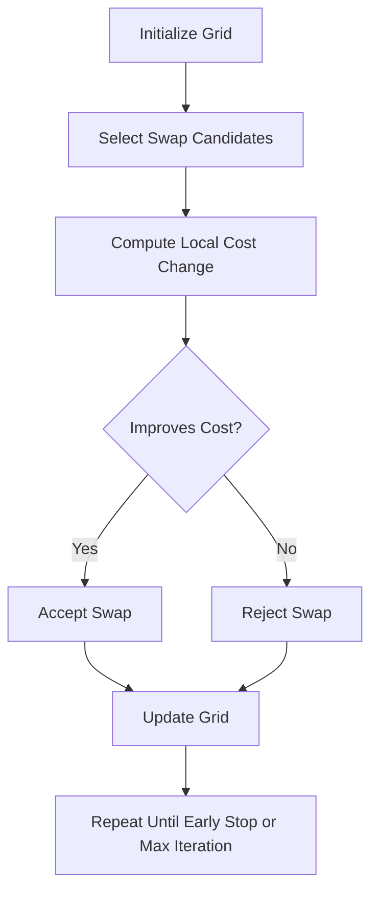

### Baseline ACOM Metrics

| Variant | Final cost | Cost improvement | Neighborhood preservation | Trustworthiness | Stress |
|---|---:|---:|---:|---:|---:|
| `acom_v1_baseline` | 275.767 | 25.063 | 0.134 | 0.567 | 5.120 |

### Baseline ACOM Grid

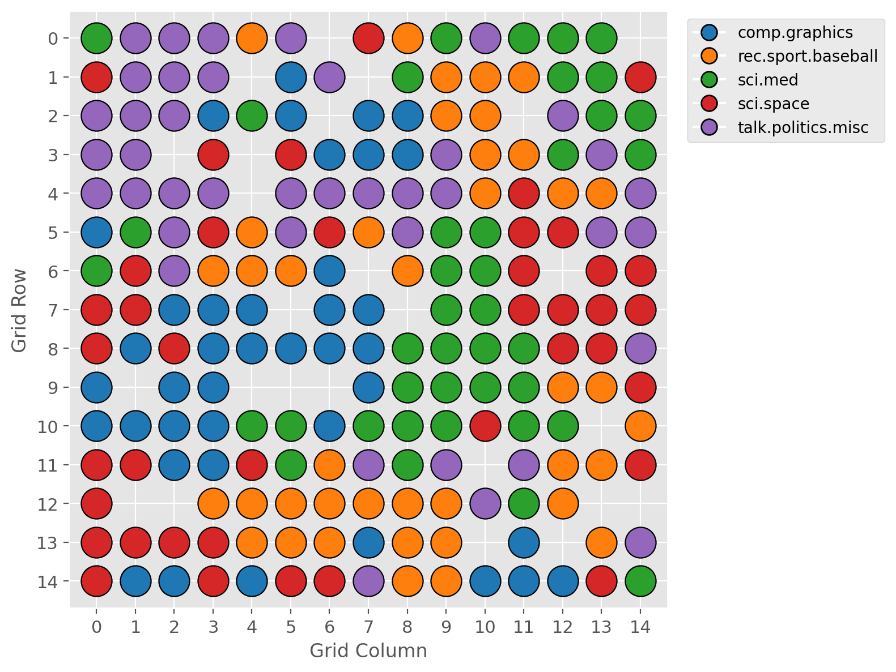

*Figure 2. Discrete grid produced by the first ACOM baseline run.*

### Baseline ACOM Cost History

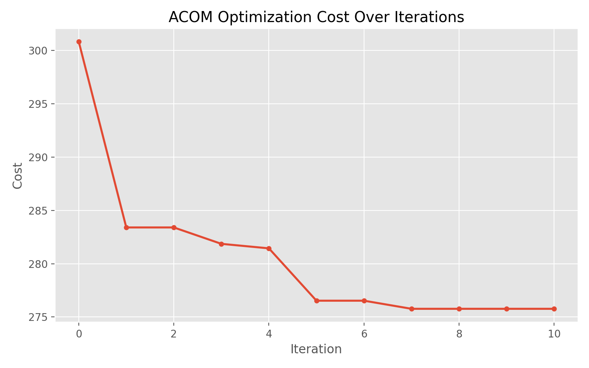

*Figure 3. Cost curve for the first ACOM baseline run.*

### Initial Limitations

The first version improved its internal objective, but the external structure-preservation metrics were weak. Neighborhood preservation and trustworthiness were both low, and the cost curve suggests that greedy local search was not exploring the search space aggressively enough.

## 7. Observed Problems

The baseline run made the main weaknesses of the initial design visible:

1. **Greedy search trapped the optimizer early.**
   The cost curve in Figure 3 falls quickly and then plateaus, which is typical of local trapping.

2. **Neighborhood preservation was poor.**
   The baseline score of `0.134` was well below later tuned results.

3. **Trustworthiness was weak relative to the tuned variant and the continuous baselines.**
   The baseline trustworthiness of `0.567` indicates that many neighbors in the mapped grid were not reliable neighbors in embedding space.

### Baseline vs Tuned ACOM

| Variant | Neighborhood preservation | Trustworthiness | Final cost |
|---|---:|---:|---:|
| `acom_v1_baseline` | 0.134 | 0.567 | 275.767 |
| `acom_v1_wider_swap_annealed` | 0.367 | 0.787 | 213.015 |

This baseline-to-tuned gap motivated the controlled ACOM improvement phase.

## 8. Algorithm Improvements

The algorithm was improved incrementally rather than replaced wholesale. Each variant changed one main ingredient at a time so that the reason for any improvement remained interpretable.

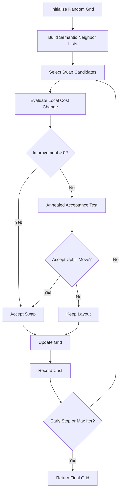

### Version Evolution at a Glance

| Version / Variant | Main change | Why it was introduced | Key outcome |
|---|---|---|---|
| `acom_v1_baseline` | Greedy swap-based baseline | Establish a simple discrete benchmark | Worked, but local-structure metrics were weak |
| `acom_v1_k10` | More semantic neighbors | Test whether broader semantic context helps placement | Improved over baseline, but only moderately |
| `acom_v1_more_iters` | More iterations | Test whether the baseline was simply under-optimized | Improved cost and metrics, but still plateaued |
| `acom_v1_wider_swap_search` | Wider candidate search | Reduce poor local proposals and broaden search | First major jump in neighborhood preservation and trustworthiness |
| `acom_v1_wider_swap_annealed` | Annealed acceptance on top of wider search | Escape local minima created by greedy acceptance | Best ACOM variant overall |

This table captures the development logic of the project: start with a simple baseline, identify the main failure mode, then improve search breadth and search flexibility before changing anything more complicated.

### Variant Comparison Table

| Variant | Main change | Final cost | Cost improvement | Neighborhood preservation | Trustworthiness | Stress |
|---|---|---:|---:|---:|---:|---:|
| `acom_v1_baseline` | Greedy baseline | 275.767 | 25.063 | 0.134 | 0.567 | 5.120 |
| `acom_v1_k10` | More semantic neighbors | 261.565 | 47.815 | 0.189 | 0.609 | 5.115 |
| `acom_v1_more_iters` | More iterations | 252.119 | 48.711 | 0.191 | 0.637 | 5.115 |
| `acom_v1_stronger_repulsion` | Higher repulsion | 354.963 | 27.676 | 0.137 | 0.574 | 5.120 |
| `acom_v1_radius2` | Larger local radius | 570.195 | 56.417 | 0.188 | 0.625 | 5.116 |
| `acom_v1_wider_swap_search` | Wider candidate search | 234.524 | 66.307 | 0.239 | 0.683 | 5.112 |
| `acom_v1_wider_swap_annealed` | Wider search + annealing | 213.015 | 87.815 | 0.367 | 0.787 | 5.107 |

### Variant Comparison Figure

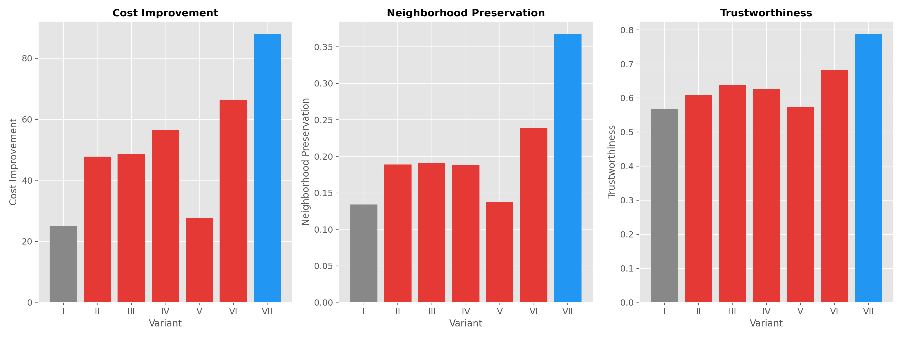

*Figure 4. Comparison of cost improvement, neighborhood preservation, and trustworthiness across named ACOM variants.*

### Improvement Step 1: Wider Swap Candidate Search

The first clearly successful change was **wider swap search**. Increasing the candidate breadth from `12` to `20` improved:

- neighborhood preservation from `0.134` to `0.239`
- trustworthiness from `0.567` to `0.683`
- final cost from `275.767` to `234.524`

**Evidence:** the wider-search row in the variant comparison table and the jump visible in Figure 4.

**Interpretation:** better candidate coverage improved the search process itself. The objective stayed the same, but the optimizer became better at finding useful moves.

### Improvement Step 2: Annealed Acceptance

The strongest improvement came from adding **annealed acceptance** on top of wider search. This change addressed the main weakness of the greedy baseline: once the search reached a locally acceptable arrangement, it tended to stop making meaningful progress. Relative to `acom_v1_wider_swap_search`, the annealed variant improved:

- neighborhood preservation from `0.239` to `0.367`
- trustworthiness from `0.683` to `0.787`
- final cost from `234.524` to `213.015`

**Evidence:** the last two rows of the variant comparison table and the rightmost ranking in Figure 4.

**Interpretation:** occasional uphill moves reduced local trapping and produced more semantically coherent layouts than greedy acceptance alone.

### Tuned Cost History as Evidence of Reduced Plateauing

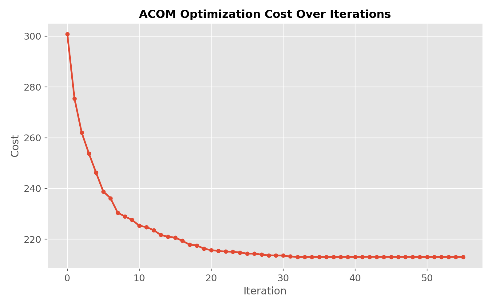

*Figure 5. Cost history for `acom_v1_wider_swap_annealed`, showing a deeper descent than the baseline greedy run.*

Taken together, Figures 3 and 5 provide the clearest visual explanation for why the final ACOM version was selected: the tuned variant continues improving where the baseline begins to flatten.

## 9. Evaluation Metrics

All methods are evaluated against the original embedding space using the same metric implementation.

### Neighborhood Preservation

Measures how many nearest neighbors from the original embedding space remain neighbors after mapping. Higher is better.

### Trustworthiness

Measures whether neighbors introduced by the mapped space are genuinely close in the original embedding space. Higher is better.

### Stress

Measures the mismatch between original pairwise distances and mapped distances. Lower is better.

### Experiment Pipeline

## 10. Experimental Results

The main comparison in this project is the tuned ACOM variant against PCA, t-SNE, and UMAP on the same 100-document embedding set.

### Final Tuned Comparison

| Method | Neighborhood Preservation | Trustworthiness | Stress |
|---|---:|---:|---:|
| ACOM (Tuned) | 0.367 | 0.787 | 5.107 |
| PCA | 0.329 | 0.758 | 0.612 |
| t-SNE | 0.523 | 0.893 | 13.242 |
| UMAP | 0.505 | 0.897 | 2.850 |

### Metric Comparison Figure

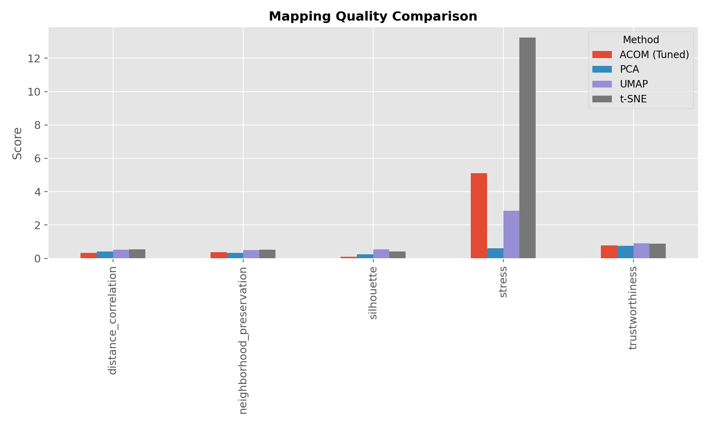

*Figure 6. Final metric comparison between the tuned ACOM variant and the continuous baselines.*

### Interpretation

- **ACOM vs PCA:** tuned ACOM outperformed PCA on neighborhood preservation (`0.367` vs `0.329`) and trustworthiness (`0.787` vs `0.758`), but PCA remained much stronger on stress (`0.612` vs `5.107`).
- **ACOM vs t-SNE:** t-SNE remained stronger on local structure, with neighborhood preservation `0.523` and trustworthiness `0.893`.
- **ACOM vs UMAP:** UMAP also remained stronger on local structure and achieved much lower stress (`2.850`) than tuned ACOM.
- **Among the continuous baselines:** UMAP showed the strongest overall balance in this comparison because it combined high neighborhood preservation and trustworthiness with substantially lower stress than t-SNE.

The key result is therefore mixed but meaningful: the tuned ACOM variant became competitive with PCA on local structure while still remaining a discrete method, but continuous nonlinear methods retained a clear advantage on local semantic preservation.

### Baseline Comparison Discussion

**What ACOM does better**

- produces an explicit discrete grid rather than a scatter plot
- improves on PCA in neighborhood preservation and trustworthiness
- yields a map that is immediately interpretable as a placement layout

**What ACOM still does worse**

- underperforms t-SNE and UMAP on local semantic structure
- shows much higher stress than PCA
- degrades more noticeably as the document count increases

**Why that is still acceptable in this project**

The purpose of ACOM is not to beat every continuous method on every metric. It solves a harder discrete placement problem. The value of ACOM is that it produces an interpretable, explicit semantic grid while remaining quantitatively competitive enough to justify further research.

### Practical Runtime Note

Runtime data is available for embedding generation and for the ACOM scaling study.

| Task | Scope | Runtime |
|---|---|---:|
| Embedding generation | 100 documents, `all-MiniLM-L6-v2` | `5.7658 s` |
| Tuned ACOM scaling run | 50 documents | `13.3635 s` |
| Tuned ACOM scaling run | 100 documents | `15.1044 s` |
| Tuned ACOM scaling run | 150 documents | `38.9926 s` |
| Tuned ACOM scaling run | 200 documents | `36.0956 s` |

### Discretized Baseline Comparison

A natural question is whether the gap between ACOM and the continuous baselines is partly an artifact of comparing discrete grid coordinates against unconstrained continuous coordinates. To test this, the continuous PCA, t-SNE, and UMAP positions were discretized onto the same 10×10 grid used by ACOM. Each method's continuous (x, y) coordinates were binned into grid cells using uniform partitioning, and all evaluation metrics were recomputed on the resulting cell-center coordinates. This places every method under the same geometric constraint and allows a like-for-like comparison.

The results show that discretization has only a modest effect on the continuous baselines' quality metrics. PCA neighborhood preservation drops from `0.329` to `0.324`, t-SNE from `0.523` to `0.490`, and UMAP from `0.505` to `0.471`. Trustworthiness shows a similar pattern of minimal change: PCA moves from `0.758` to `0.764`, t-SNE from `0.893` to `0.889`, and UMAP from `0.897` to `0.886`. The metric changes are small enough to confirm that the quality differences between ACOM and the continuous baselines are structural rather than measurement artifacts of the coordinate representation.

However, discretization reveals a critical difference in output quality: all three continuous methods produce significant cell collisions when forced onto the grid. A collision occurs when multiple documents are assigned to the same grid cell, which makes the layout unusable as a one-document-per-cell semantic map.

| Method | Neighborhood Preservation | Trustworthiness | Stress | Silhouette | Collision Cells | Max Docs/Cell |
|---|---:|---:|---:|---:|---:|---:|
| ACOM (Tuned) | 0.367 | 0.787 | 5.107 | 0.097 | 0 | 1 |
| PCA (Discretized) | 0.324 | 0.764 | 0.617 | 0.249 | 27 | 8 |
| t-SNE (Discretized) | 0.490 | 0.889 | 13.140 | 0.418 | 32 | 4 |
| UMAP (Discretized) | 0.471 | 0.886 | 2.803 | 0.530 | 28 | 7 |

PCA produces 27 collision cells with up to 8 documents sharing a single cell. t-SNE produces 32 collision cells (max 4 per cell), and UMAP produces 28 (max 7 per cell). ACOM, by contrast, guarantees zero collisions by construction — every document occupies exactly one cell. This distinction is the core value proposition of ACOM: it solves the discrete placement problem that continuous methods do not address, even when those methods are post-hoc discretized.

## 11. Visual Comparison of Methods

The visual comparison helps clarify what the quantitative metrics mean in practice. The continuous methods produce smooth scatter plots, while ACOM produces a cell-based layout that can be read as an explicit semantic map.

### Tuned ACOM Grid

*Figure 7. Tuned ACOM discrete document map.*

### PCA

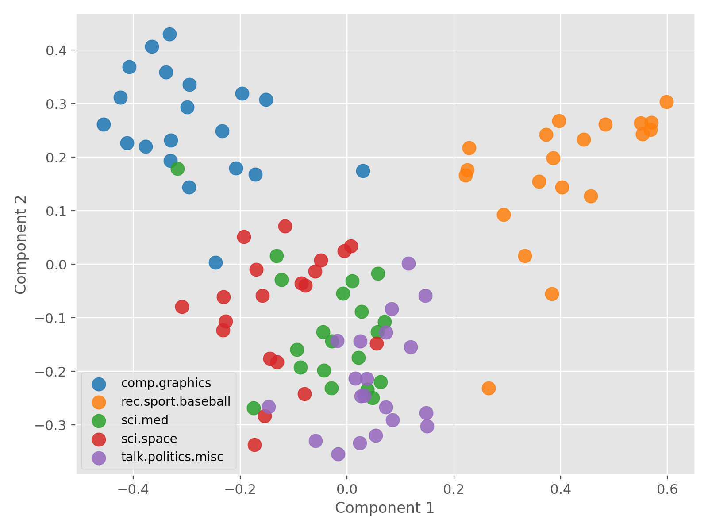

*Figure 8. PCA projection on the same embedding set.*

### t-SNE

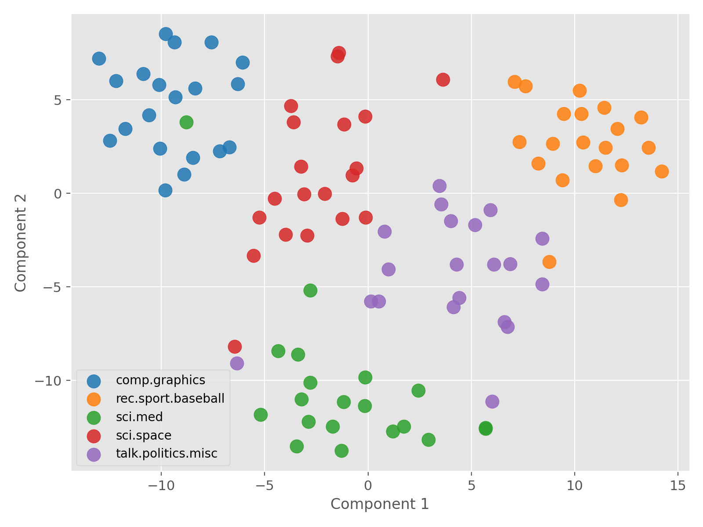

*Figure 9. t-SNE projection on the same embedding set.*

### UMAP

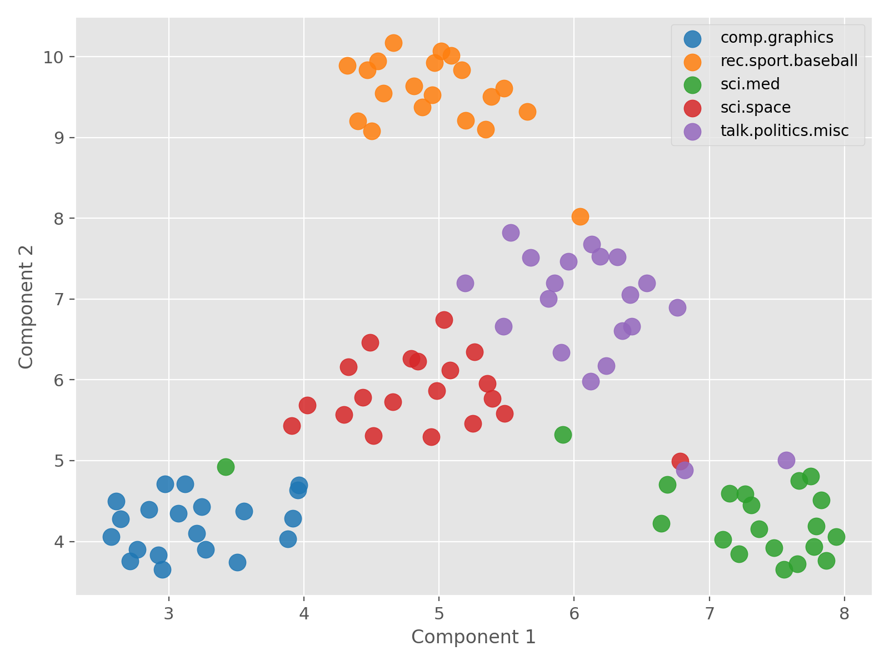

*Figure 10. UMAP projection on the same embedding set.*

### Visual Interpretation

- The tuned ACOM output is more structured and explicitly discrete, which makes it easier to interpret as a semantic grid.
- PCA is visually smooth but less effective at local separation.
- t-SNE creates the sharpest local cluster structure.
- UMAP preserves strong local structure while remaining more globally readable than t-SNE.

## 12. Best ACOM Variant

The best-performing ACOM configuration in the completed tuning study was:

- `acom_v1_wider_swap_annealed`

### Why It Performed Best

It combined the two changes that most directly addressed the main weaknesses of the baseline:

1. wider swap candidate search
2. annealed acceptance instead of purely greedy acceptance

Together, these improved both optimization quality and semantic neighborhood preservation.

### Best-Variant Summary

| Variant | Initial cost | Final cost | Cost improvement | Neighborhood preservation | Trustworthiness |
|---|---:|---:|---:|---:|---:|
| `acom_v1_wider_swap_annealed` | 300.831 | 213.015 | 87.815 | 0.367 | 0.787 |

This version was selected as the final ACOM reference because it:

- produced the **largest cost improvement** of any ACOM variant
- materially improved neighborhood preservation to `0.367`
- materially improved trustworthiness to `0.787`
- showed less premature plateauing than the greedy baseline, as seen by comparing Figure 5 with Figure 3
- became the first ACOM version in this project to beat PCA on both neighborhood preservation and trustworthiness

In short, this was the first version that improved ACOM both as an optimizer and as a semantic mapping method.

## 13. Scaling Experiments

The final phase tested whether the tuned ACOM variant remained stable as the number of documents increased. This phase answers a practical question: even if the tuned variant works on 100 documents, does it still behave reasonably on larger maps?

The scaling study used:

- the same five categories
- the same embedding model
- balanced sampling at each size
- size-specific grids: `8x8`, `10x10`, `13x13`, `15x15`

### Scaling Results Table

| Docs | Grid | Runtime (s) | Initial cost | Final cost | Improvement | Neighborhood preservation | Trustworthiness | Stress |
|---:|---|---:|---:|---:|---:|---:|---:|---:|
| 50 | 8x8 | 13.364 | 126.863 | 92.533 | 34.329 | 0.342 | 0.728 | 3.989 |
| 100 | 10x10 | 15.104 | 296.811 | 214.950 | 81.861 | 0.351 | 0.780 | 5.146 |
| 150 | 13x13 | 38.993 | 415.038 | 294.599 | 120.440 | 0.240 | 0.723 | 6.931 |
| 200 | 15x15 | 36.096 | 553.354 | 408.516 | 144.837 | 0.193 | 0.705 | 8.180 |

### Runtime Scaling

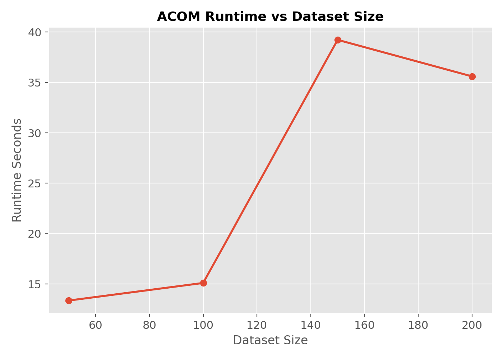

*Figure 11. Runtime trend across dataset sizes.*

### Neighborhood Preservation Scaling

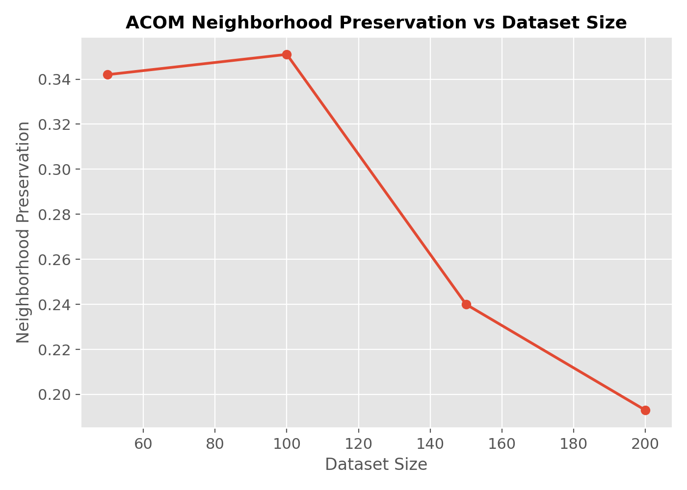

*Figure 12. Neighborhood preservation across dataset sizes.*

### Trustworthiness Scaling

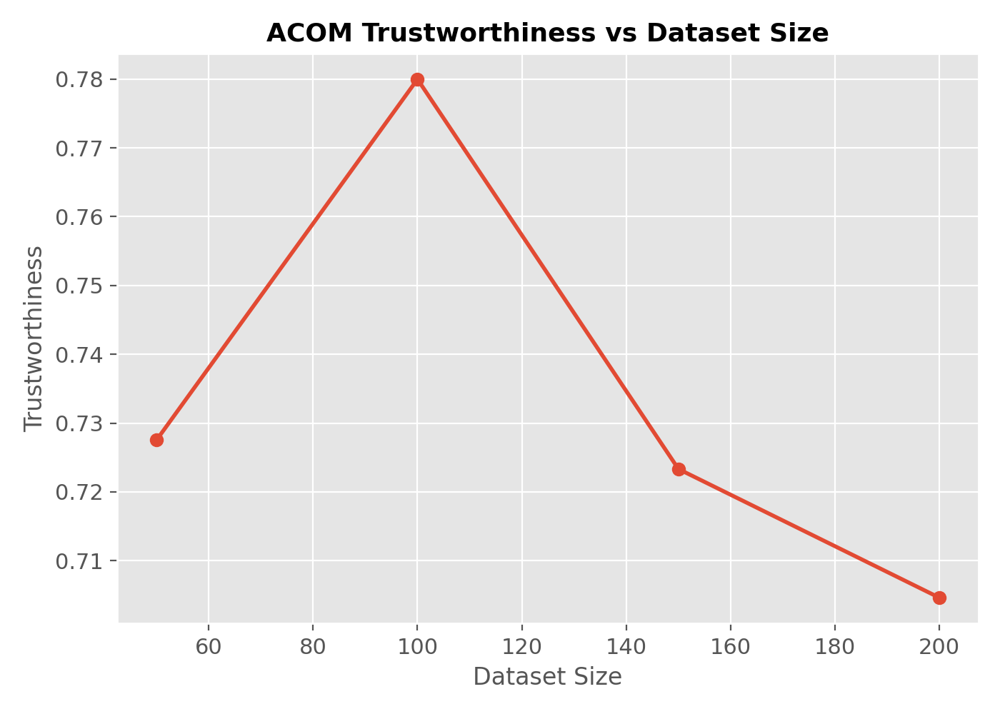

*Figure 13. Trustworthiness across dataset sizes.*

### Stress Scaling

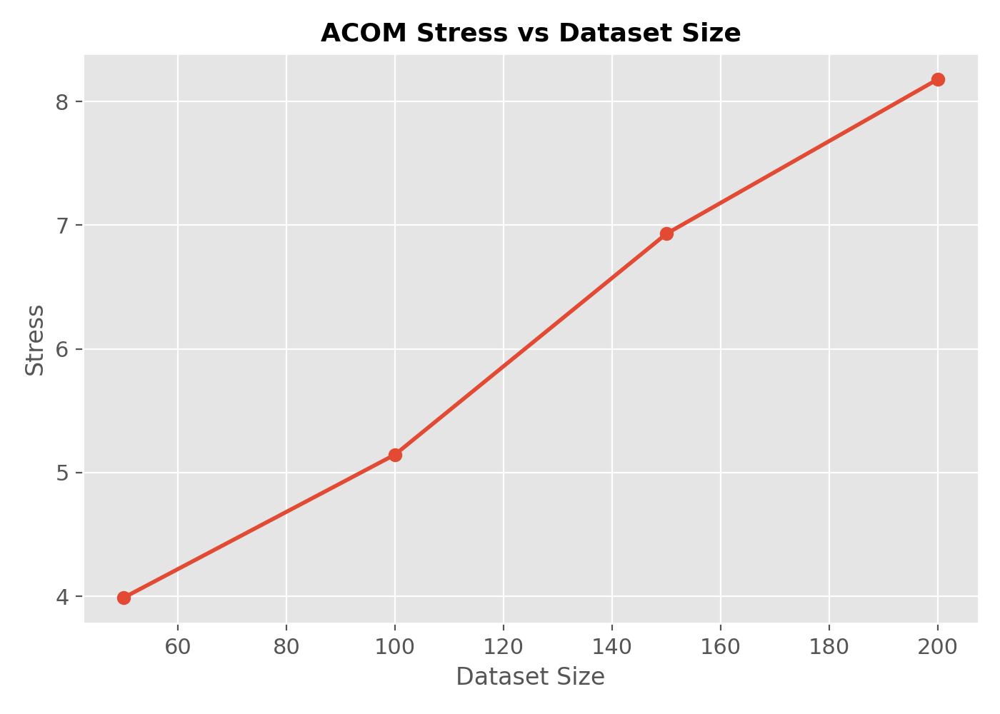

*Figure 14. Stress across dataset sizes.*

### Interpretation

- ACOM remained operational and improved cost at all sizes.
- Local structure was strongest at `100` documents.
- Quality deteriorated after `100` documents as neighborhood preservation and trustworthiness fell.
- Stress increased steadily with scale, showing that discrete distortion becomes harder to control on larger maps.

The overall conclusion is that the current best ACOM variant scales **stably**, but not **uniformly**. It continues to optimize successfully, yet the semantic quality of the final map becomes harder to maintain as the grid grows.

## 14. Limitations

The experiments reveal several clear limitations of the current Version 1 approach:

- ACOM still underperforms t-SNE and UMAP on neighborhood preservation and trustworthiness.
- Stress remains much worse than PCA, which indicates weaker preservation of global pairwise geometry.
- The discrete grid constraint introduces distortion that continuous methods do not face.
- Performance degrades beyond `100` documents in the current scaling study.
- The current optimizer is still heuristic and local, not globally optimal.

### Evidence of Remaining Gap

The final tuned comparison table and Figure 6 show that ACOM improved enough to exceed PCA on local-structure metrics, but it did not match t-SNE or UMAP on the same embedding set.

## 15. Future Work

The completed experiments suggest several promising next steps:

- **Targeted swap proposals**
  Prioritize documents with the highest local cost and move them toward stronger semantic neighborhoods.

- **Alternative cost functions**
  Weight local and global structure more explicitly rather than relying only on the current attraction/repulsion balance.

- **Multi-scale mapping**
  Build coarse-to-fine layouts so larger document sets are not optimized from a single flat initialization.

- **Hierarchical grid layouts**
  Use nested regions or topic-aware subgrids to reduce congestion in large maps.

Among these, the most immediately promising improvement is a **more targeted swap proposal mechanism**, because the tuning and scaling experiments both suggest that search efficiency is the main bottleneck once the grid becomes larger.
