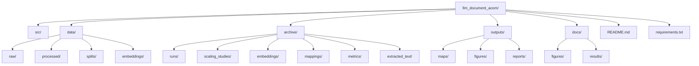

# Repository Structure

## Overview

The repository is organized to separate source code, working data, latest outputs, archived experiments, and public-facing documentation. The layout supports both iterative development and reproducible research reporting.

## Major Directories

- `src`
  Source modules for data preparation, embedding generation, ACOM, baselines, metrics, visualization, and experiment runners.

- `data`
  Working dataset area for raw downloads, processed inputs, split definitions, and embedding arrays.

- `archive`
  Long-term experiment records, including timestamped runs, the run index, and scaling-study snapshots.

- `outputs`
  Latest generated maps, figures, and reports.

- `docs`
  Human-facing documentation plus selected tracked figures and result summaries.

## Repository Diagram

## `src`

Important modules include:

- [`src/prepare_20newsgroups.py`](../src/prepare_20newsgroups.py)
- [`src/generate_embeddings.py`](../src/generate_embeddings.py)
- [`src/run_experiment.py`](../src/run_experiment.py)
- [`src/run_acom_sweep.py`](../src/run_acom_sweep.py)
- [`src/run_acom_scaling.py`](../src/run_acom_scaling.py)
- [`src/generate_thesis_results.py`](../src/generate_thesis_results.py)
- [`src/acom.py`](../src/acom.py)
- [`src/grid.py`](../src/grid.py)
- [`src/baselines.py`](../src/baselines.py)
- [`src/metrics.py`](../src/metrics.py)
- [`src/visualization.py`](../src/visualization.py)

## `data`

The `data` directory contains the working dataset and embedding artifacts used by the pipeline.

- `raw/`
  Raw dataset exports and the local scikit-learn cache used for 20 Newsgroups downloads.

- `processed/`
  Cleaned JSONL files, embedding input files, and processed CSV assets.

- `splits/`
  CSV split definitions for the prepared benchmark and scaling subsets.

- `embeddings/`
  Aligned embedding arrays and metadata CSV files used directly by the experiment runners.

## `archive`

This is the archive of record for completed experiments.

- `runs/`
  Timestamped run folders containing `maps/`, `figures/`, `reports/`, `config/`, and `run_manifest.json`.

- `scaling_studies/`
  Study-level snapshots of scaling tables, figures, and interpretation files.

- `run_index.csv`
  Compact history of archived experiment runs.

- `embeddings/`, `mappings/`, `metrics/`, `extracted_text/`
  Additional archival directories retained for organization and supporting artifacts.

## `outputs`

This directory contains the latest generated working outputs.

- `maps/`
  Latest ACOM and baseline position files.

- `figures/`
  Latest generated plots.

- `reports/`
  Latest CSV, JSON, and Markdown summaries.

## `docs`

This directory contains documentation and selected tracked assets for repository readers.

- `figures/`
  Example figures kept in version control for quick review.

- `results/`
  Tracked summary tables and interpretation notes.

## Notes

- The durable experiment record is under `archive/`, not `outputs/`.
- There is no standalone top-level `reports/` directory.
- `outputs/` is intended for the latest run, while `archive/` is intended for comparison across runs and studies.
